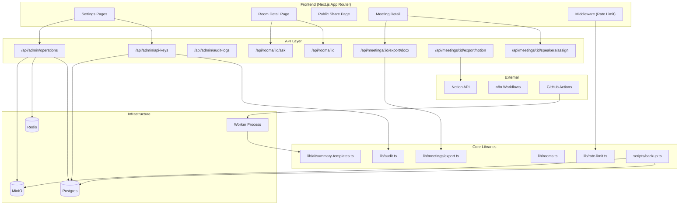

# Architecture: MeetSum v0.3.0

## System Overview

## Tech Stack Decisions

| Decision | Choice | Rationale | Alternatives Considered |
|----------|--------|-----------|------------------------|
| DOCX Generation | `docx` npm package | Lightweight, no binary deps, runs in Node.js | `officegen` (abandoned), Pandoc (system dep) |
| Rate Limit Store | In-memory → Redis upgrade path | Single-instance VPS doesn't need Redis yet | Redis-backed from day 1 (premature) |
| Notion Integration | Official `@notionhq/client` | Well-maintained, TypeScript-first | Raw REST (more code) |
| Backup Strategy | `pg_dump` + `mc mirror` | Standard tools, already available in containers | Custom export (fragile) |
| Desktop Recorder | Electron + system audio capture | Cross-platform, proven for audio capture | Tauri (immature audio APIs) |

## Data Model

### Entity: ApiKey
| Field | Type | Notes |
|-------|------|-------|
| id | `api_key_<uuid>` | Primary key |
| label | string | User-defined name |
| keyHash | string | bcrypt hash of the raw key |
| keyPrefix | string(8) | First 8 chars for identification |
| createdAt | timestamp | |
| expiresAt | timestamp? | Null = never expires |
| revokedAt | timestamp? | Null = active |
| lastUsedAt | timestamp? | Updated on each auth |

### Entity: OperationalMetrics (computed, not persisted)
| Metric | Source | Query |
|--------|--------|-------|
| Queue depth | Redis | `bullmq.getJobCounts()` |
| Failed jobs | Postgres | `SELECT count(*) FROM jobs WHERE status='failed'` |
| Calendar sync lag | Postgres | `NOW() - last google_sync_state.updated_at` |
| Storage usage | MinIO | `mc admin info` |
| AI run stats | Postgres | `SELECT avg(latency_ms), percentile_cont(0.95)...` |

### Relationships
- ApiKey → AuditLog (1:many via `targetId`)
- Meeting → SpeakerMapping (1:many, new table)
- Room → Meeting (many:many via `meeting_contexts`, existing)

## API Design

### New Endpoints

| Method | Path | Auth | Description |
|--------|------|------|-------------|
| GET | `/api/admin/api-keys` | Admin | List API keys (masked) |
| POST | `/api/admin/api-keys` | Admin | Create new API key |
| DELETE | `/api/admin/api-keys/:id` | Admin | Revoke API key |
| GET | `/api/admin/operations` | Admin | Operational metrics |
| GET | `/api/meetings/:id/export/docx` | Required | Download DOCX export |
| POST | `/api/meetings/:id/export/notion` | Required | Push to Notion |
| POST | `/api/meetings/:id/speakers/assign` | Required | Assign speakers to persons |

### Error Handling
- All new endpoints use `jsonError()` from `lib/api/responses.ts`
- Rate-limited endpoints return `429` with `Retry-After` header
- Notion export failures surface as structured error with Notion API error code

## Component Breakdown

### Rate Limit Middleware
- **Responsibility:** Intercept requests, check rate limit, return 429 or pass through
- **Dependencies:** `lib/rate-limit.ts` (existing)
- **Interface:** Next.js middleware in `middleware.ts`, pattern-matched routes

### API Key Manager
- **Responsibility:** CRUD for API keys with secure hashing
- **Dependencies:** `lib/auth/api-keys.ts` (existing hash logic), `lib/audit.ts`
- **Interface:** 3 API routes + Settings UI page

### DOCX Exporter
- **Responsibility:** Convert MeetingRecord to .docx buffer
- **Dependencies:** `docx` npm package, `lib/meetings/export.ts`
- **Interface:** `renderMeetingDocx(meeting): Buffer`

### Speaker Assignment Manager
- **Responsibility:** Map speaker labels to participant identities
- **Dependencies:** `lib/meetings/repository.ts`
- **Interface:** `assignSpeakers(meetingId, mappings[])` + UI modal

### Operational Dashboard
- **Responsibility:** Aggregate and display system health metrics
- **Dependencies:** Postgres, Redis, MinIO connections
- **Interface:** API route + React page

## Infrastructure

- **Hosting:** Hetzner CPX32 VPS (unchanged)
- **CI/CD:** GitHub Actions (existing lint/test/typecheck) + optional auto-deploy
- **Environments:** Production only (single VPS)
- **Monitoring:** Operational dashboard replaces SSH-based monitoring

## Security

- **Authentication:** Google OAuth + API keys (unchanged)
- **Authorization:** Admin-only routes check session role
- **Data Protection:** API keys bcrypt-hashed, raw key shown once on creation
- **API Security:** Rate limiting on all public and resource-intensive endpoints
